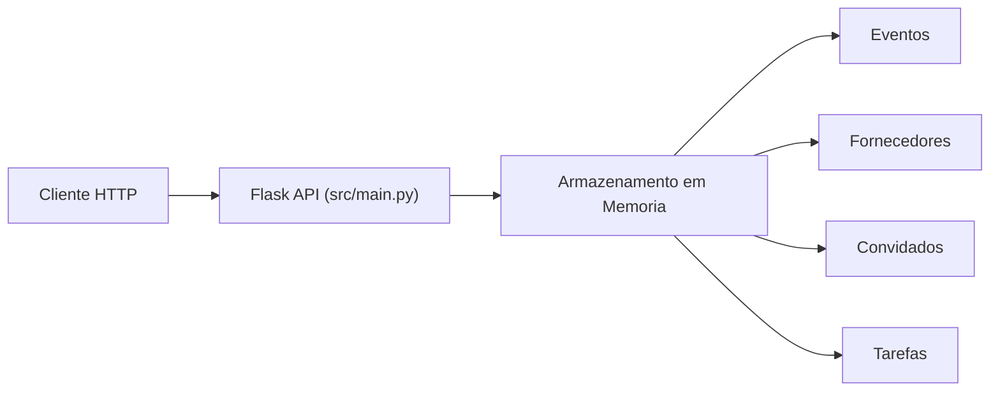
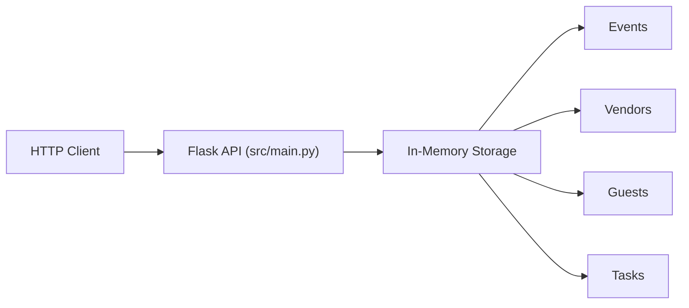

# Event Planning System

[](https://www.python.org/)
[](https://flask.palletsprojects.com/)
[](LICENSE)
[](Dockerfile)

[Portugues](#portugues) | [English](#english)

---

## Portugues

### Visao Geral

API REST para planejamento de eventos construida com Flask. Oferece CRUD completo para eventos, fornecedores, convidados e tarefas, com dados de exemplo incluidos para demonstracao.

**Nota:** Os dados sao armazenados em memoria. Todos os dados sao perdidos ao reiniciar o servidor.

### Arquitetura



### Funcionalidades

- CRUD de eventos (titulo, data, local, orcamento, status)
- CRUD de fornecedores com filtro por categoria
- CRUD de convidados com filtro por evento
- Tarefas vinculadas a eventos
- Dashboard com estatisticas (total de eventos, convidados, orcamento)
- Dados de exemplo pre-carregados

### Inicio Rapido

```bash
# Clonar o repositorio
git clone https://github.com/galafis/Event-Planning-System.git
cd Event-Planning-System

# Criar ambiente virtual
python -m venv venv
source venv/bin/activate  # Windows: venv\Scripts\activate

# Instalar dependencias
pip install -r requirements.txt

# Executar a aplicacao
python src/main.py
```

O servidor inicia em `http://localhost:5000`.

### Endpoints da API

| Metodo | Rota | Descricao |
|--------|------|-----------|
| GET | `/api/events` | Listar eventos |
| POST | `/api/events` | Criar evento |
| GET | `/api/events/<id>` | Obter evento |
| PUT | `/api/events/<id>` | Atualizar evento |
| DELETE | `/api/events/<id>` | Remover evento |
| GET | `/api/vendors` | Listar fornecedores |
| POST | `/api/vendors` | Criar fornecedor |
| GET | `/api/guests` | Listar convidados |
| POST | `/api/guests` | Criar convidado |
| PUT | `/api/guests/<id>` | Atualizar convidado |
| POST | `/api/events/<id>/tasks` | Adicionar tarefa |
| PUT | `/api/events/<id>/tasks/<id>` | Atualizar tarefa |
| GET | `/api/dashboard/stats` | Estatisticas do dashboard |

### Estrutura do Projeto

```
Event-Planning-System/
├── src/
│   ├── main.py           # Aplicacao Flask e rotas da API
│   ├── templates/
│   │   └── index.html    # Dashboard web
│   └── __init__.py
├── tests/
│   ├── test_main.py      # Testes com Flask test_client
│   └── __init__.py
├── Dockerfile
├── requirements.txt
├── LICENSE
└── README.md
```

### Testes

```bash
pytest tests/ -v
```

### Docker

```bash
docker build -t event-planning-system .
docker run -p 5000:5000 event-planning-system
```

---

## English

### Overview

REST API for event planning built with Flask. Provides full CRUD for events, vendors, guests, and tasks, with sample data included for demonstration.

**Note:** Data is stored in memory. All data is lost when the server restarts.

### Architecture



### Features

- Event CRUD (title, date, venue, budget, status)
- Vendor CRUD with category filtering
- Guest CRUD with event filtering
- Tasks linked to events
- Dashboard with statistics (total events, guests, budget)
- Pre-loaded sample data

### Quick Start

```bash
# Clone the repository
git clone https://github.com/galafis/Event-Planning-System.git
cd Event-Planning-System

# Create virtual environment
python -m venv venv
source venv/bin/activate  # Windows: venv\Scripts\activate

# Install dependencies
pip install -r requirements.txt

# Run the application
python src/main.py
```

The server starts at `http://localhost:5000`.

### API Endpoints

| Method | Route | Description |
|--------|-------|-------------|
| GET | `/api/events` | List events |
| POST | `/api/events` | Create event |
| GET | `/api/events/<id>` | Get event |
| PUT | `/api/events/<id>` | Update event |
| DELETE | `/api/events/<id>` | Delete event |
| GET | `/api/vendors` | List vendors |
| POST | `/api/vendors` | Create vendor |
| GET | `/api/guests` | List guests |
| POST | `/api/guests` | Create guest |
| PUT | `/api/guests/<id>` | Update guest |
| POST | `/api/events/<id>/tasks` | Add task |
| PUT | `/api/events/<id>/tasks/<id>` | Update task |
| GET | `/api/dashboard/stats` | Dashboard statistics |

### Project Structure

```
Event-Planning-System/
├── src/
│   ├── main.py           # Flask app and API routes
│   ├── templates/
│   │   └── index.html    # Web dashboard
│   └── __init__.py
├── tests/
│   ├── test_main.py      # Tests with Flask test_client
│   └── __init__.py
├── Dockerfile
├── requirements.txt
├── LICENSE
└── README.md
```

### Tests

```bash
pytest tests/ -v
```

### Docker

```bash
docker build -t event-planning-system .
docker run -p 5000:5000 event-planning-system
```

---

### Author

**Gabriel Demetrios Lafis**
- GitHub: [@galafis](https://github.com/galafis)
- LinkedIn: [Gabriel Demetrios Lafis](https://linkedin.com/in/gabriel-demetrios-lafis)

### License

This project is licensed under the MIT License - see the [LICENSE](LICENSE) file for details.
